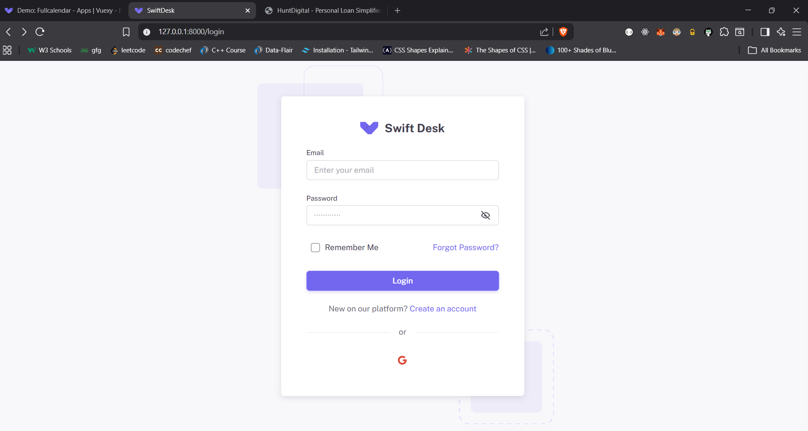

# Selenium Login Automation (Python)

This project contains a Python Selenium script used to automate a Laravel login page.
The script opens the login page, fills the email and password fields with random values, and closes the browser.

---

## Requirements

The following software is required to run this project:

- Python 3.8 or higher
- Google Chrome browser
- Selenium library

---

## Login Page 


## Python Installation

Check if Python is installed:

```bash
python --version  
```
---
### Install Selenium (Online)


```bash
python -m pip install selenium
```
Verify installation:

```bash
python -c "import selenium; print(selenium.__version__)"
```
---

### Install Selenium (Offline Using .whl File)

Steps:
1. Download
```bash
selenium-4.17.2-py3-none-any.whl
```
from:
https://pypi.org/project/selenium/#files

2. Place the .whl file in the same folder as login_automation.py

3. Run
```bash
python -m pip install selenium-4.17.2-py3-none-any.whl
```
---

### How to Run the Script
1. Open PowerShell in the project folder
2. Run the command:
```bash
python <file name>
```
3. Chrome browser will open automatically
4. Email and password fields will be filled automatically
5. mail and password fields will be filled automatically

----